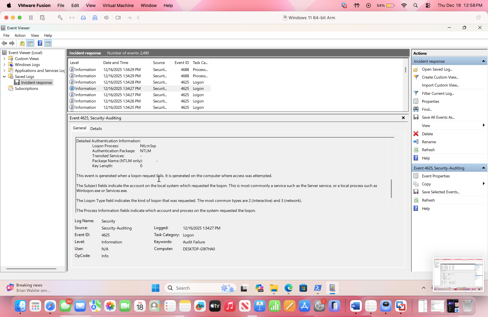

## rdp-bruteforce-detection-lab
  Simulated RDP brute-force attack with Windows event log analysis and MITRE ATT&CK mapping.

## Overview
This project simulates a brute-force attack against a Windows 11 system using RDP and demonstrates detection of malicious authentication attempts using Windows Security Event Logs.
## Objectives
- Simulate RDP brute-force authentication attempts
- Detect failed logon activity using Event ID 4625
- Build an incident timeline
- Map attacker behavior to MITRE ATT&CK

## Environment 
- Victim: Windows 11 Pro (ARM)
- Attacker: Kali Linux
- Network: Private/NAT (isolated lab)
- Tools: Hydra, Event Viewer, Powershell

## Key Findings
- Repeated failed logon attempts observed
- Logon Type: 3 (Network)
- No successful authentication occurred
- Brute-force attempt identified and contained

# MITRE ATT&CK Mapping 
- T1110 - Brute Force
- T1078 - Valid Accounts (attempted)

## Documentation
[Step-by-Step Lab Guide] (docs/step-by-step-lab.md)
[Incident Report] (docs/incident-report.md)

## Limitations
- Network traffic analysis was limited due to Wireshark capture constraints on the Windows ARM environment.
- Detection relied on Windows Security Event Logs rather than centralized SIEM correlation.
- Attack simulation focused on a single technique (RDP brute force) and did not include post-compromise activity.
- NAT networking limited visibility into external network telemetry.

## Evidence

The following screenshot shows Event ID 4625 with Logon Type 3 and repeated failed authentication attempts.

