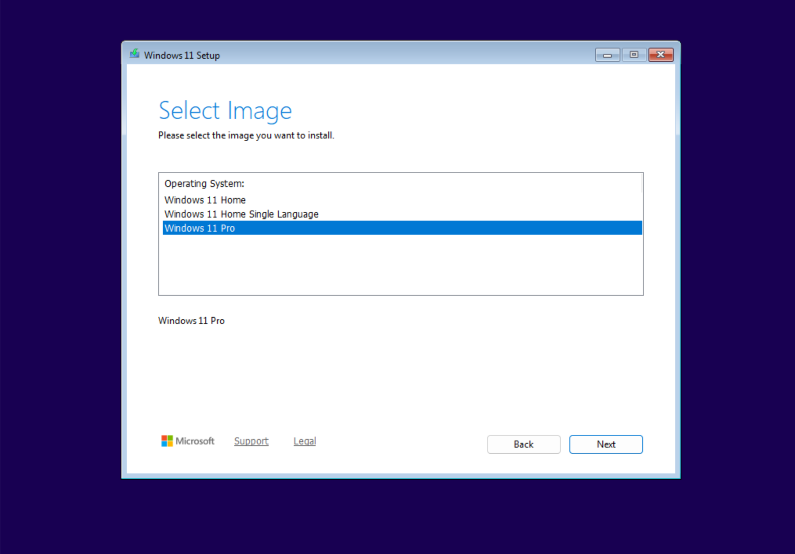
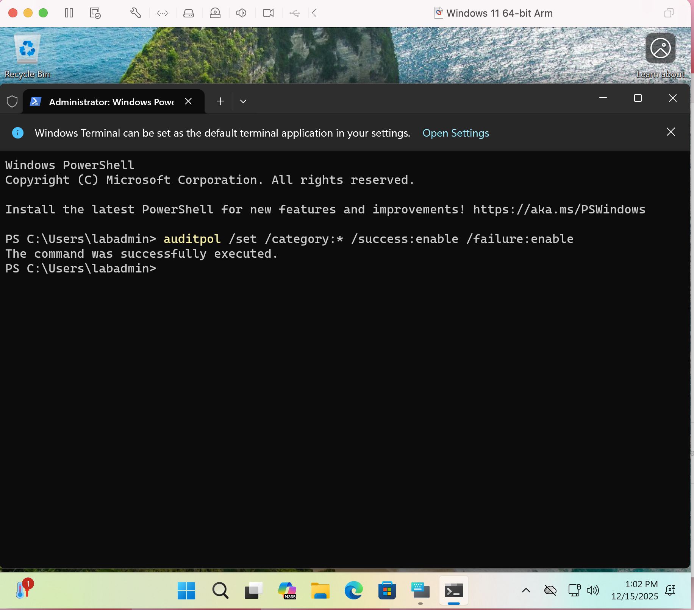
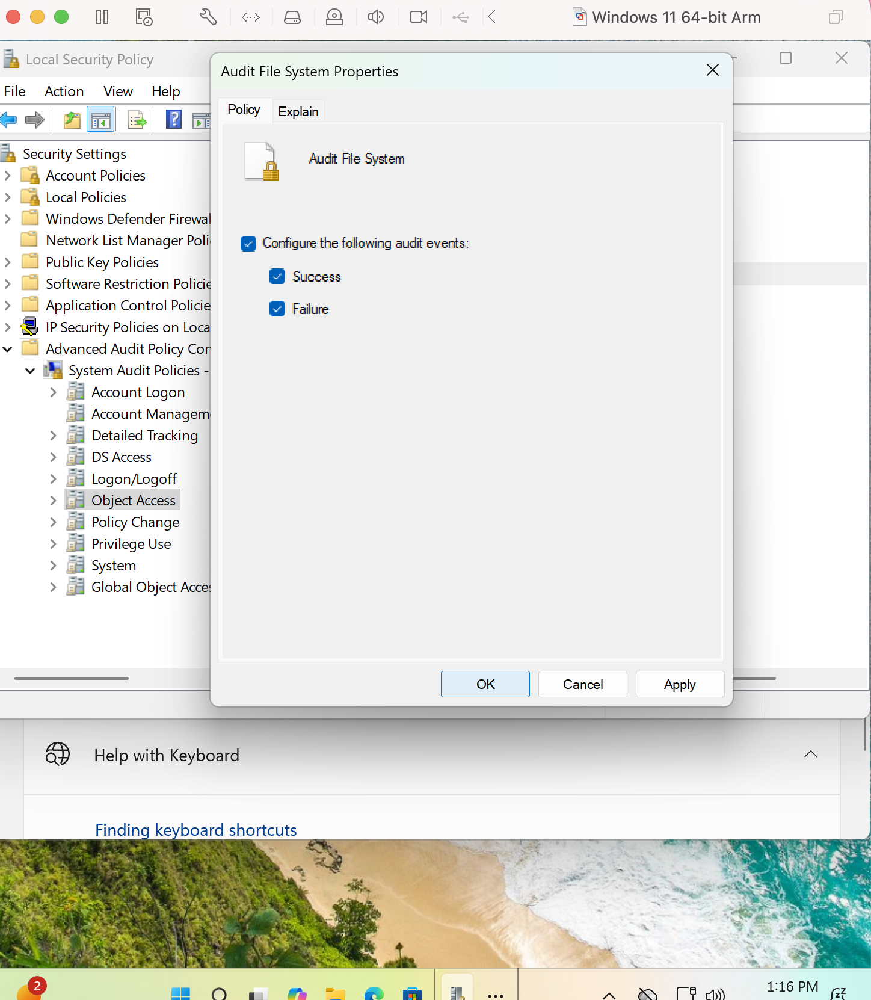
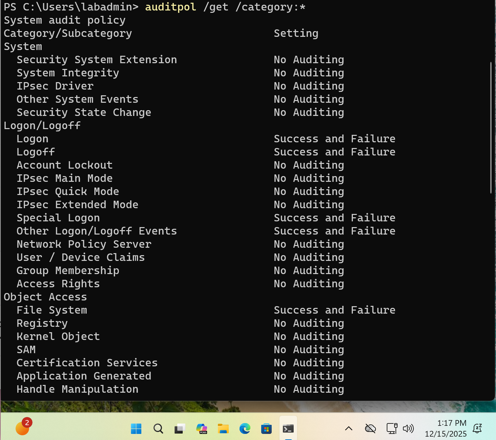
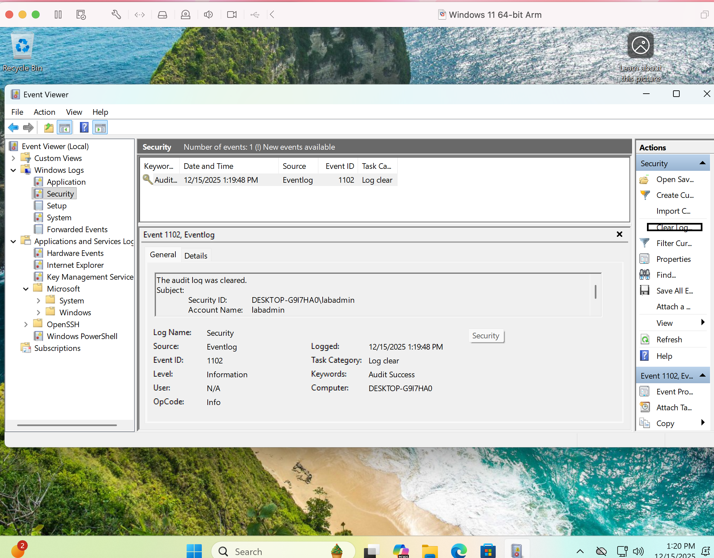
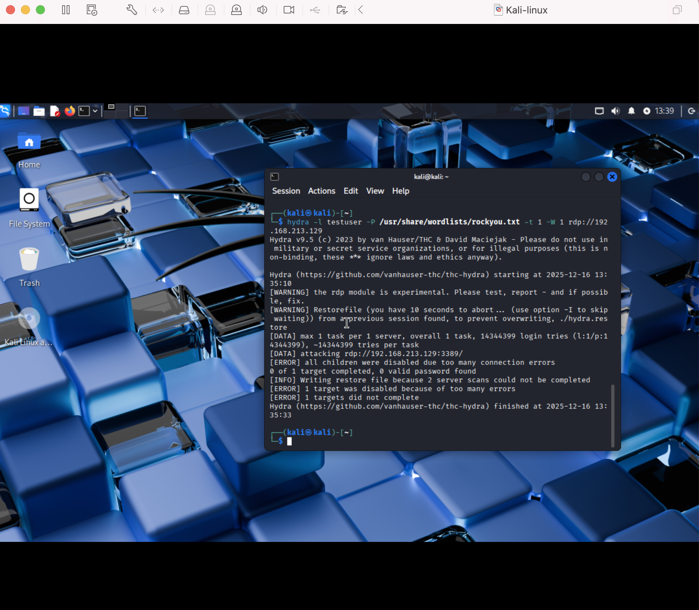
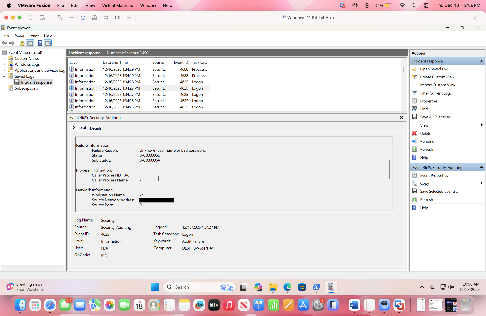

RDP Brute-Force Detection Lab

Objective:

This lab demonstrates how to simulate and detect a remote RDP brute-force attack against a Windows 11 system using native Windows Security Event Logs. The goal is to validate host-based detection capabilities and identify brute-force authentication behavior.

Environment:

- Attacker: Kali Linux VM
- Victim: Windows 11 Pro (ARM) VM
- Host OS: macOS
- Network: Private/NAT network
- Protocol: RDP (TCP 3389)

Setup:

Windows VM, this is the victim

- Download the Windows 11 ARM64 ISO from Microsoft: <https://www.microsoft.com/en-us/software-download/windows11arm64>
- Create a new virtual machine in VMware Fusion using the ISO.
- Configure hardware settings:
  - Memory 4-8 GB
  - Processors: 2 cores
  - Hard disk: 60-80 GB
  - Network: Private/ NAT network
- Select UEFI firmware.
- Enable TPM encryption (default settings)
- Booth the VM normally.
- Select Windows 11 Pro during installation.

During initial Windows setup, bypass the network requirement to create a local account:

- On the network connection screen, select the Accessibility icon.
- Enable the on-screen keyboard.
- Press Shift + Fn + F10 to open Command Prompt.
- Enter: OOBE\\BYPASSNRO
- Allow the VM to restart
- Select " I don't have internet" and continue with local account creation

Create a standard local account:

- Navigate to Settings -> Accounts -> Other users
- Create a user named 'testuser' with a password

Kali Linux VM, this is the attacker

- Download Kali Linux Virtual Machine here <https://www.kali.org/get-kali/#kali-virtual-machines>
- Ensure they are the same network then ping both to each other.

&nbsp;

- Logging Configuration:

- Open command prompt as admin and enter:

auditpol /set /category:\* /success:enable /failure:enable

- Setting -> Accessibility -> Toggle on-screen keyboard on
- Press Window icon + R to open registry
- Type: secpol.msc
-Go to Security Settings → Advanced Audit Policy Configuration → System Audit Policies.

- **Logon/Logoff:** enable Success + Failure for:
  - Audit logon
  - Audit logoff
  - Audit other logon/logoff events
  - Audit special logon

- **Account Management:** enable Success + Failure for:
  - Audit user account management
  - Audit security group management
  - Audit computer account management

- **Privilege Use:** enable Success + Failure for:
  - Audit sensitive privilege use

- **Object Access:** enable Success + Failure for:
  - Audit file system
  - Audit registry

- **Detailed Tracking:** enable Success + Failure for:
  - Audit process creation
  - Audit process termination

- - Verify auditing configurations:
        - auditpol /get /category:\*

- - To apply policies immediately run: gpupdate /force.
    - To clear logs:
      - Click windows icon on dash -> Event viewer -> windows logs -> security -> right column of main screen click clear logs

- - Ensure the Windows VM remains powered on.

Simulate the attack

- On the Windows VM, open Command Prompt and run: netstat -an | find "3389" if no results so:
  - - In powershell as admin run: Get-Service -Name TermService
            - - Expected output :- Name: termservice status: running
                - If not running run: Start-Service -Name TermService
      - In same powershell run: Get-NetFirewallRule -DisplayGroup "Remote Desktop" | Select DisplayName, Enabled
        - this should come back true
      - If not enabled run: Enable-NetFirewallRule -DisplayGroup "Remote Desktop"
      - To stay enabled after reboot enter: Set-Service -Name TermService -StartupType Automatic
- Start Kali Linux VM
- Login
- Open terminal (normal user)
- ping &lt;Windows-IP&gt;
  - On the Windows VM, open Command Prompt and run: ipconfig
- hydra -l testuser -P /usr/share/wordlists/rockyou.txt -t 1 -W 1 rdp://&lt;Windows-IP&gt;

Expected Results:

\- Multiple Windows Security Event ID 4625 entries

\- Logon Type: 3 (Network)

\- Target account: testuser

\- Source Network Address: Kali Linux VM IP

Note: Account lockout policies were not configured, and no successful authentication (Event ID 4624) was observed during this simulation.

Detection Validation:

- - Event ID 4625 is repeatedly logged
    - Logon type 3 is observed
    - The source IP matches the attacker VM
    - The target account is a valid local user.

Evidence Collection:

Windows Security Event Logs were collected and exported from Event Viewer.

- File: \`incident-response.evtx\`
- Source: Windows Logs → Security
- Relevant Event ID: 4625
